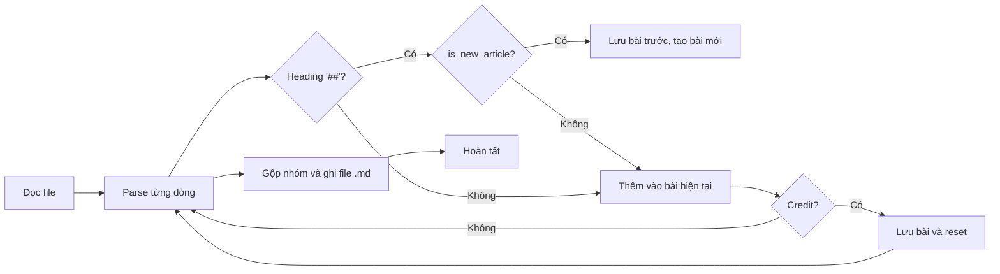

# Markdown Chunking

## Cấu Trúc Repo

Thư mục src chứa script, được chia thành 2 folder nhỏ:

- dong: Phương án của Đông
- hoang: Phương án của Hoàng

## Thuật Toán

### Phương án 1: Traditional Chunking

Phương án này có mỗi file chứa 4 bài viết (có thể tùy ý điều chỉnh lại). Các file được tách dựa trên heading và credit cuối bài.

#### Mô tả các hàm, biến

```is_new_article```: Xác định mục ```##``` là heading bài mới hay chỉ là mục con

```slugify```: Tạo title cho các file nhỏ được tách ra

```split_markdown```: Logic chính để chia file

- ```articles```: Lưu trữ tất cả bài viết đã được tách ra
- ```current_article```: Lưu trữ bài viết hiện tại
- ```article_title```: Title cho bài viết hiện tại
- ```inside_article```: Bool để xác định có đang ở trong bài viết hay không
- ```group_count```: Đếm số thứ tự nhóm bài viết để đặt tên

#### Workflow



#### Đã khắc phục được

- Gom được nhiều bài vào cùng 1 file, có thể tùy chỉnh số lượng bài trong 1 file thông qua biến ```GROUP_SIZE```
- Cắt bài đã tổng quát hơn, có phương án kiểm tra xem ```##``` là heading bài mới hay chỉ là mục con

#### Một số điểm cần cải thiện

- Một số file gốc không dùng heading dạng ```##``` mà dùng placeholder