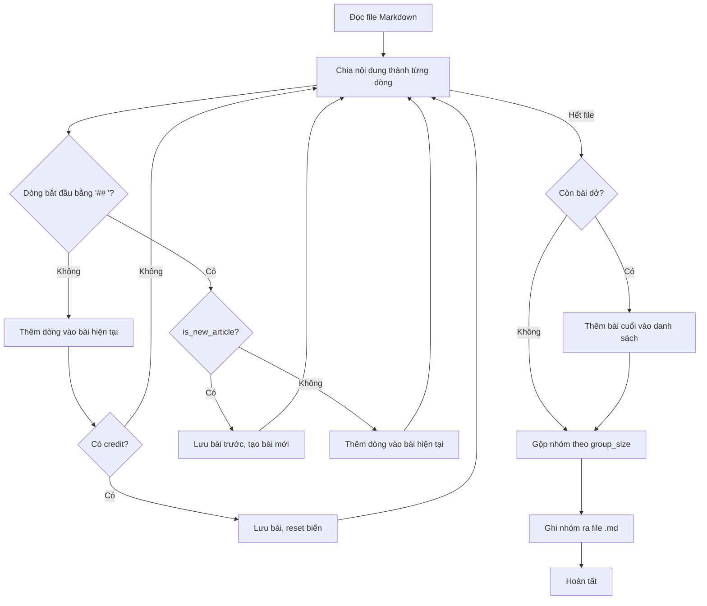
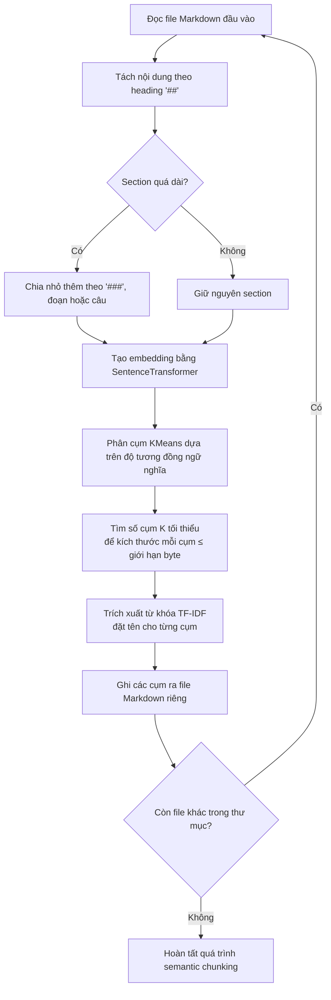

# Markdown Chunking

## Cấu Trúc Repo

Thư mục src chứa script, được chia thành 2 folder nhỏ:

- dong: Phương án của Đông
- hoang: Phương án của Hoàng

## Thuật Toán

### Phương án 1: Traditional Chunking

Phương án này có mỗi file chứa 4 bài viết (có thể tùy ý điều chỉnh lại). Các file được tách dựa trên heading và credit cuối bài.

#### Cài đặt

```bash
pip install unidecode
```

---

#### Mô tả các hàm, biến

```is_new_article```: Xác định mục ```##``` là heading bài mới hay chỉ là mục con

```slugify```: Tạo title cho các file nhỏ được tách ra

```split_markdown```: Logic chính để chia file

- ```articles```: Lưu trữ tất cả bài viết đã được tách ra
- ```current_article```: Lưu trữ bài viết hiện tại
- ```article_title```: Title cho bài viết hiện tại
- ```inside_article```: Bool để xác định có đang ở trong bài viết hay không
- ```group_count```: Đếm số thứ tự nhóm bài viết để đặt tên

---

#### Workflow



---

#### Đã khắc phục được

- Gom được nhiều bài vào cùng 1 file, có thể tùy chỉnh số lượng bài trong 1 file thông qua biến ```GROUP_SIZE```
- Cắt bài đã tổng quát hơn, có phương án kiểm tra xem ```##``` là heading bài mới hay chỉ là mục con

---

#### Một số điểm cần cải thiện

- Một số file gốc không dùng heading dạng ```##``` mà dùng placeholder

---

### Phương án 2: Mix Chunking

Phương án này dùng phương pháp tách file từ phương pháp 1 ra những file nhỏ sau đó sử dụng Model ngôn ngữ để gộp cái file có chung ý lại thành file lớn hơn sao cho file này không vượt quá số dung lượng cho phép (tổng quát hơn phương án 1).

#### Mô tả các hàm, biến

- `slugify` : Tạo title cho các file nhỏ được tách ra
- `chunk_markdown_by_headings` : Logic chính để tách file theo `## ` (H2)
- `split_large_chunk` : Tự động chia nhỏ phần vượt quá giới hạn bytes (dùng `###`, đoạn, rồi tới hard-wrap)
- `normalize_corpus_to_size` : Đảm bảo không có chunk nào > giới hạn trước khi phân cụm
- `get_cluster_labels` : Đặt tiêu đề cụm dựa trên TF‑IDF (top 3 cụm từ)
- `cluster_with_k` : Phân cụm K‑Means theo embedding
- `choose_k_by_max_file_size` : Tăng K cho đến khi tất cả file ≤ giới hạn
- `save_clusters_to_files` : Ghi các cụm ra thư mục
- Biến chính: `articles` (ẩn trong pipeline), `inside_article`, `group_count` (ẩn), ... tương đương như sơ đồ

#### Workflow (Mermaid)

<div style="zoom:0.75">



</div>

#### Tính năng chính

- Xử lý **toàn bộ thư mục** `.md` (có thể đệ quy).
- **Giới hạn kích thước** mỗi file theo bytes: `--max-size` (mặc định **1 MB** để test nhanh).
- **Embedding đa ngôn ngữ**: `paraphrase-multilingual-MiniLM-L12-v2`.
- **Tiêu đề chủ đề tự động** bằng TF‑IDF.
- Xuất Markdown **sạch, dễ đọc**.

---

#### Cài đặt

```bash
pip install -U sentence-transformers scikit-learn unidecode numpy
```

---

```bash
python -m cluster_markdown.main input/ clustered-output --max-size 1024 --recursive
# hoặc sau khi đóng gói:
# markdown-cluster input/ clustered-output --max-size 1024 --recursive
```

- `--max-size`: giới hạn bytes / file (ví dụ `1*1024*1024` = 1 MB)
- `--recursive`: quét đệ quy thư mục con
- `--pattern`: mẫu glob (mặc định `*.md`)

> **Lưu ý:** `1 * 1024` = **1 KB**. Để dùng 1 MB, đặt `--max-size 1048576` hoặc `1*1024*1024` trong code.

---

#### Cấu trúc thư mục gợi ý

```
.
├── cluster_markdown/
│   ├── __init__.py
│   └── main.py
├── input/
│   ├── sample1.md
│   └── sample2.md
├── README.md
└── requirements.txt
```
---

#### Một số điểm cần cải thiện

- Có thể dùng CUDA hoặc CPU accelartion để tăng tốc độ xử lí
